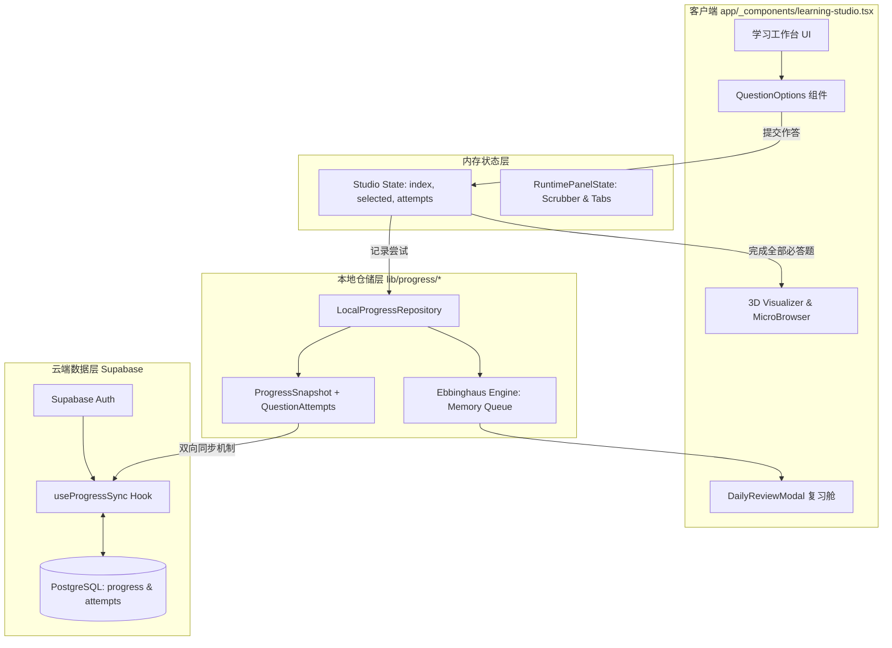

# NodePath P1 阶段（提升理解与留存）开发与实施总纲

> **文档状态**：现行生效开发指南  
> **适用阶段**：Phase 1 - 提升理解与留存（Understanding & Retention）  
> **受众对象**：前端工程师、课程设计团队、后端/ Supabase 开发人员、测试工程师  

---

## 1. P1 阶段核心目标与设计哲学

NodePath 的核心愿景是通过“先预测/诊断、后运行观察、再总结固化”的方式，帮助学习者建立真实工程心智模型。在 MVP（P0 阶段）完成课程结构搭建与 3D/微浏览器基础可视化后，**P1 阶段的核心目标是：提升理解深度与学习留存率**。

### 1.1 核心度量指标 (Target Metrics)
1. **理解深度 (Understanding)**：
   - 错题重做首次通过率提高 40%。
   - 复杂题型（诊断、修复、执行顺序）答题停留时长与有效推理比例提升。
   - 代码方案对比卡片的有效点击率与展开率提升。
2. **留存与复购 (Retention)**：
   - 次日留存率 (Day-1 Retention) 目标 ≥ 45%，七日留存率 (Day-7 Retention) 目标 ≥ 25%。
   - 艾宾浩斯到期复习完成率 ≥ 60%。
   - 学习连胜 (Streak) 保持 3 天以上的用户比例提升 50%。

### 1.2 P1 五大工程支柱
```
┌─────────────────────────────────────────────────────────────────────────────┐
│                      NodePath P1 核心工程支柱                            │
├───────────────┬───────────────┬───────────────┬───────────────┬─────────────┤
│ 1. 多维题型   │ 2. 艾宾浩斯   │ 3. Supabase   │ 4. 具身因果   │ 5. 质量校验 │
│    交互工程   │    留存引擎   │    云端同步   │    可视化增强 │    自动化管线│
│ (Question UI) │ (Repetition)  │ (Cloud Sync)  │ (Visualizer)  │ (Validator) │
└───────────────┴───────────────┴───────────────┴───────────────┴─────────────┘
```

---

## 2. P1 阶段总体架构设计

### 2.1 数据与状态流图



---

## 3. 开发规范与子文档套件索引

为确保团队协作高效、代码规范统一，P1 阶段拆分为以下 3 份专项开发规范文档：

### 3.1 [P1 题型与交互开发规范](file:///Users/huo2wx/coding/react/learning-app/with-supabase/docs/specs/p1-question-interaction-spec.md)
* **包含内容**：
  - 5 大新增认知题型（`diagnosis`, `repair`, `completion`, `execution-order`, `best-practice`）的 TypeScript Schema 定义。
  - 移动端优先的交互规则：折叠差异代码行、高亮修改区域、顺序排序拖拽/点击机制。
  - 定向反馈（Option-specific Feedback）编写导向，区分“错误现象”、“直接原因”与“根本原因”。

### 3.2 [P1 艾宾浩斯复习与留存引擎规范](file:///Users/huo2wx/coding/react/learning-app/with-supabase/docs/specs/p1-spaced-repetition-retention-spec.md)
* **包含内容**：
  - 基于 SM-2 改良的编程预测题间隔复习算法（Ebbinghaus Spaced Repetition Formula）。
  - `DailyReviewModal` 复习队列计算、错题本状态机（New, Reviewing, Mastered）。
  - 学习连胜 (Streak Counter) 算法、打卡重置时区策略与游戏化成就触发钩子。

### 3.3 [P1 Supabase 数据架构与同步规范](file:///Users/huo2wx/coding/react/learning-app/with-supabase/docs/specs/p1-supabase-data-architecture.md)
* **包含内容**：
  - PostgreSQL 数据库 Schema（`profiles`, `progress_snapshots`, `question_attempts`, `user_review_items`）。
  - 行级安全策略 (RLS Policy) 与 Auth 用户态管理。
  - 离线优先 (Offline-First) 架构：本地 `localStorage` 与云端 `Supabase` 的冲突解决（LWW - Last Write Wins & Timestamp Merge）。

---

## 4. P1 阶段功能清单与开发里程碑

### 4.1 里程碑 M1：题型扩展与数据记录（已完成/验证）
- [x] 扩展 `LessonQuestion` 接口与材料字段 (`materialTitle`, `materialCode`, `orderItems`)。
- [x] 在 `QuestionOptions` 中实现诊断题、修复题、补全题与顺序题的专用 UI。
- [x] 扩展 `ProgressSnapshot.questionAttempts`，记录题目级作答历史、首次正确率与待复习标记。
- [x] 完成 Node.js (92 案例) 与 Next.js (90 案例) 的 P1 题库覆盖。

### 4.2 里程碑 M2：云端数据同步与艾宾浩斯复习（当前推进中）
- [ ] 部署 Supabase Migration 脚本（创建 `question_attempts` 与 `user_review_items` 表）。
- [ ] 接入 `useProgressSync` 钩子，实现用户登录后自动拉取并合并本地与云端进度。
- [ ] 升级 `DailyReviewModal`，从 `questionAttempts` 实时生成到期复习队列，支持直接启动专属复习 Session。
- [ ] 增加复习完成后的掌握度状态提升反馈（Mastered Badge Animation）。

### 4.3 里程碑 M3：沉浸式因果可视化与步进控制（后续重点）
- [ ] 为所有阶段项目与重点知识点补充专属 3D 粒子/节点场景。
- [ ] 完善 `TraceTimelineScrubber` 控制条与 `RuntimePanelState` 状态同步，保证拖拽选帧时 3D 场景与微型浏览器 Preview 同步响应。
- [ ] 完善 `ProductionIncidentHUD` 在复杂事故（如内存泄漏、背压堵塞、连接池耗尽）下的动态诊断过程。

---

## 5. 质量保障与验收标准 (QA & CI Checklists)

每次发布或提交代码前，必须执行以下指令与 Checklists：

### 5.1 命令链校验
```bash
# 1. 课程数据与 P1 题库规范校验
npm run validate:curriculum

# 2. 全量单元测试与集成测试
npm test

# 3. TypeScript 类型严格检查
npx tsc --noEmit

# 4. 代码风格检查与格式规范
npm run lint
git diff --check

# 5. Turbopack 构建验证
npm run build
```

### 5.2 移动端 UI 验收点
- [ ] 移动端设备（宽度 ≤ 430px）下，代码选项无溢出，差异高亮区域可纵向/横向顺畅滚动。
- [ ] 顶部工具舱在窄屏下平滑折叠，不遮挡主导航。
- [ ] 3D 运行舱在弱网或低性能移动设备上自动降级为深色 fallback，无 Canvas 假死或白屏现象。

---

## 6. 文档更新规范

依据仓库根目录 `AGENTS.md` 的约束：
- 每次完成 P1 阶段的功能变动或架构修改，必须同步更新：
  1. `docs/PRODUCT.md`（产品现状与案例数量）
  2. `docs/ARTICHECTURE.md`（模块边界与架构拓扑）
  3. `session-handoff.md`（会话状态与验证结果）

---

*NodePath Team - 保持极简、聚焦理解、驱动留存*
