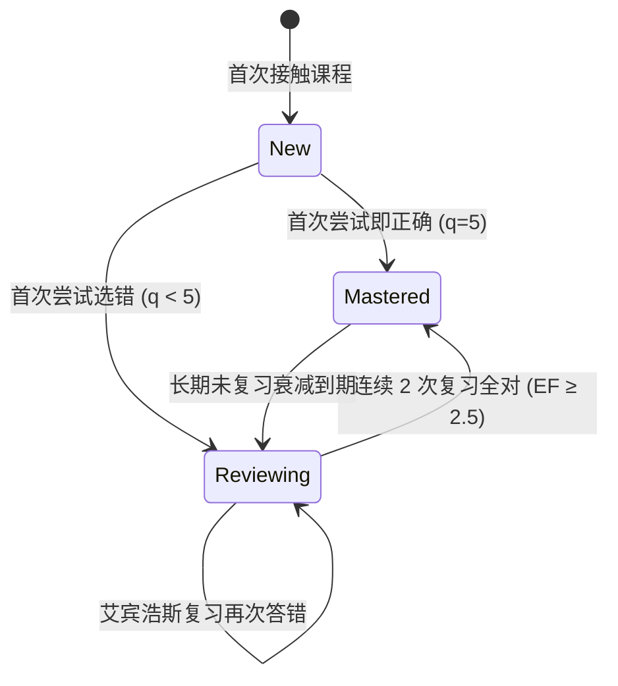

# P1 艾宾浩斯复习与留存引擎规范 (Spaced Repetition & Retention Spec)

> **所属主文档**：[P1 阶段开发总纲](file:///Users/huo2wx/coding/react/learning-app/with-supabase/docs/P1-DEVELOPMENT-GUIDE.md)  
> **适用模块**：`lib/progress/*` / `components/review/*` / `components/gamification/*`  

---

## 1. 留存引擎核心逻辑

编程学习容易陷入“当时看懂，过几天全忘”的困境。P1 留存引擎结合**艾宾浩斯遗忘曲线（Ebbinghaus Forgetting Curve）**与**SuperMemo SM-2 算法**，对用户在学习过程中的每次答题记录进行量化建模，自动推算最佳复习节点。

```
[初次答题] ───> [记录首次正确率 & 尝试次数]
                     │
                     ▼
          [计算记忆衰减因子 EF]
                     │
                     ▼
     ┌──────────────────────────────┐
     │ 动态生成间隔天数 (Interval):  │
     │ Day 1 -> Day 3 -> Day 7 -> 14│
     └───────────────┬──────────────┘
                     │
                     ▼
       [推入 DailyReviewModal 到期队列]
```

---

## 2. 间隔复习算法公式 (Spaced Repetition Formula)

### 2.1 尝试评分与间隔因子 (Easiness Factor, EF)

针对选择/预测题型，将用户的作答表现简化归一为分值 $q \in [0, 5]$：

- **5 分**：首次作答即正确，且思考用时短。
- **3 分**：尝试 2 次后正确。
- **1 分**：尝试 3 次以上才正确（有猜题成分）。
- **0 分**：选错且最终放弃或未通过。

### 2.2 记忆衰减公式

$$EF' = EF + (0.1 - (5 - q) \times (0.08 + (5 - q) \times 0.02))$$

- **初始值**：$EF = 2.5$
- **最小硬性边界**：$EF_{min} = 1.3$
- **下一次复习间隔天数 ($I_n$)**：
  - $I(1) = 1 \text{ 天}$
  - $I(2) = 3 \text{ 天}$
  - $I(n) = I(n-1) \times EF'$

---

## 3. 错题本与掌握度状态机



### 3.1 数据结构 (`QuestionAttempt`)
```typescript
// lib/progress/types.ts

export interface QuestionAttempt {
  questionId: string;
  lessonId: string;
  courseId: string;
  lastSelectedOptionId: string;
  attemptsCount: number;         // 总尝试次数
  isFirstTryCorrect: boolean;     // 首次是否正确
  firstAttemptAt: string;        // 首次作答 ISO 时间
  lastAttemptAt: string;         // 最近作答 ISO 时间
  
  // 留存引擎扩展
  easinessFactor: number;        // 记忆因子 EF (默认 2.5)
  intervalDays: number;          // 当前复习间隔
  nextReviewAt: string;          // 下次复习 ISO 时间
  reviewState: "new" | "reviewing" | "mastered";
}
```

---

## 4. 每日复习舱与打卡留存 UI (`DailyReviewModal.tsx`)

### 4.1 复习任务队列计算 (`getReviewQueue()`)
1. 过滤当前课程中 `nextReviewAt <= currentTime` 的所有题目。
2. 优先按 `reviewState === 'reviewing'`（错题库）排序，其次按到期时间升序排列。
3. 限制单日推荐复习上限为 15 道题，避免学习者产生负荷压力。

### 4.2 学习连胜 (Streak Track)
- **计算法则**：若用户在当地自然日 (00:00 - 23:59) 内完成至少 1 课或 3 道复习题，`streakCount` 加 1。
- **中断保护**：断卡后提供 1 次“连胜复活卡”（完成双倍复习任务解锁）。

---

## 5. 验收标准 Checklists

- [ ] 在 `DailyReviewModal` 中展示当前待复习总数、错题强化数与到期数。
- [ ] 复习模式下答对题目，系统的 `nextReviewAt` 按 SM-2 算法顺延，且复习进度条实时推进。
- [ ] 清理缓存后重新登录 Supabase，能完整同步打卡连胜天数与到期复习队列。
